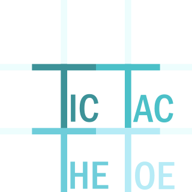

# tictacthetoe 🎲
TicTacToeTheToe aims to be a platform of multiple games all derived from the basic principle of tic tac toe.

## Games 🕹️
The first Game to be added to the platform is Meta Tic Tac Toe. Sometimes known as Ultimate Tic Tac Toe.

### Meta / Ultimate Tic Tac Toe 🤖🌐⭕❌

Meta Tic Tac Toe, also known as Ultimate Tic Tac Toe, is a variant of the classic game of Tic Tac Toe. It takes the basic concept of Tic Tac Toe and adds a strategic layer to it, making the game more complex and interesting.

#### Game Principle 📐

The game consists of a 3x3 grid of smaller Tic Tac Toe boards. Each small 3x3 board is referred to as a local board, and the larger 3x3 grid is referred to as the global board.

The goal of the game is to win the global board by getting three in a row - either horizontally, vertically, or diagonally - on the global board.

#### Gameplay 🎮

1. The first player can place their mark (either 'X' or 'O') on any cell within any local board.
2. The choice of the cell in the local board determines the next local board the opponent will play in. For example, if the first player places their mark in the top right cell of a local board, the opponent must then play in the local board in the top right of the global board.
3. If a move is played so that it is to win a local board by the rules of normal Tic Tac Toe, then the entire local board is marked as a victory for the player in the global board.
4. Once a local board is won by a player or it is filled completely, it is no longer in play. Any move that sends the opponent to such a board grants the opponent the right to play on any board of their choice. 
5. The game continues until a player wins the global board or there are no legal moves remaining, in which case the game is a draw. 

This variant of Tic Tac Toe introduces a significant amount of strategy compared to the original game. Players must think ahead and consider not only where to place their own mark, but also where their move will send their opponent. 🧠✨

#### TODO 📝
**General**
- [ ] design winning screen
- [ ] add possibility to add a name to the player
- [ ] add leaderboard for all game modes
  - [ ] add a database to store the leaderboard
- [ ] add a restart button
- [ ] add a settings menu
- [ ] add a help menu

**HotSeat**
- [ ] stop the game when a player wins or a draw occurs
- [ ] let the player only play in the local board they are supposed to

**Online Multiplayer**

**AI**
